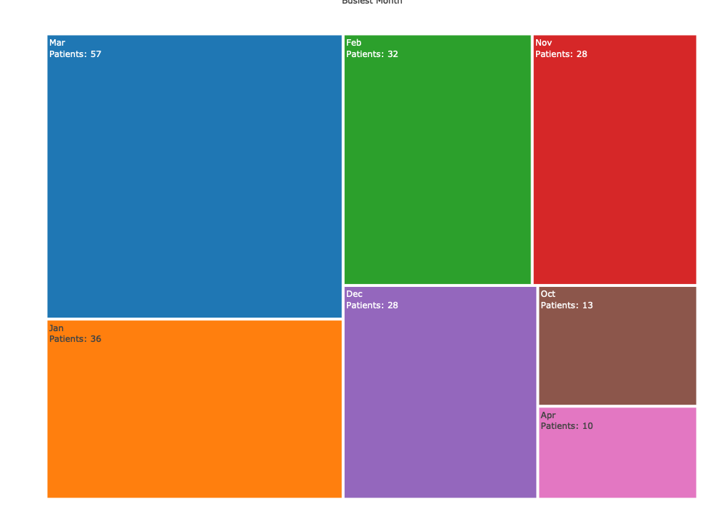

# Findings from the Student Data 
### Reason for the visit by month of the year 

 This visualization presents the distribution of reasons for patient visits segmented by the month. Each bar represents a reason segmented by what month the patient came for the checkup 

### Reason for visit based on walk-in or not

 This visualization illustrates the reasons for patient visits categorized by whether the patient walked in or had a scheduled appointment. It helps understand the proportion of walk-in visits compared to scheduled visits and the reasons behind each type of visit.

### Reason for visit based on City/State or zip code

 This chart provides insights into the distribution of reasons for patient visits based on the patient's location, either by city/state or zip code. It helps identify patterns or disparities in the reasons for visits across different areas.

### Total invoice amount based on the reason for the visit. Segmented with it was paid. 

 This visualization displays the total invoice amount for each reason for visit, segmented by whether the invoice was paid or not. It helps understand the distribution of invoice amounts across different reasons for visits and the proportion of payments made for each reason.

### Busiest month for patient visits

 This chart highlights the busiest month of the year based on the number of patients visiting. It provides a clear visualization of the peak periods of patient traffic.

